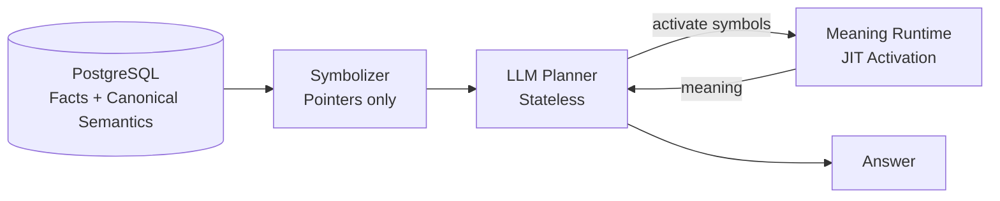

# ARCHITECTURE

This file contains the diagram and architecture view for **JIT Symbolic Memory**.
Keep README minimal and renderer-stable; put diagrams here.

---

## High-level flow (Mermaid)

---

## Layers

### Ground Truth (SQL)
- Stores facts, events, entities
- Stores canonical semantics: types, tags, stable relations
- Never stores interpretations or runtime meaning

### Symbol Layer
- Exposes database rows as **symbols** (pointers)
- Symbols contain only minimal metadata
- Symbols do not contain meaning

### Meaning Runtime (JIT)
- LLM selects which symbols to activate (budgeted)
- Runtime resolves symbols into facts + canonical semantics
- Meaning is computed *in the moment* and can be discarded

### Planner / Answer
- LLM stays stateless
- Uses only activated meanings
- Does not write interpretations back to storage

---

## One-line rule

**Store semantics. Compute meaning. Never confuse the two.**
